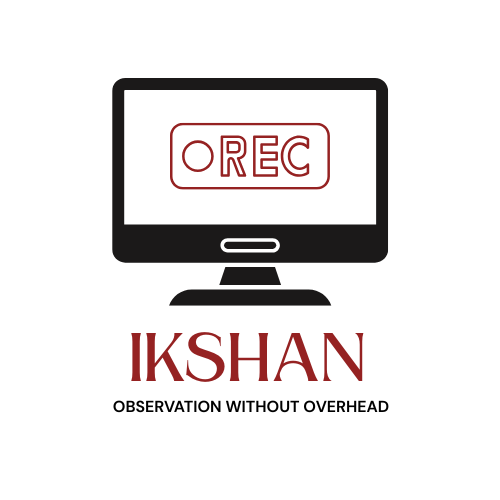

# IKSHAN

  

**Observation without overhead.**

Ikshan is a fast, local-first screen recorder written in Rust.
Clone it, build it, and record your system — no cloud, no accounts.

## Status

🚧 Early development. Core recording in progress.

## License

MIT
